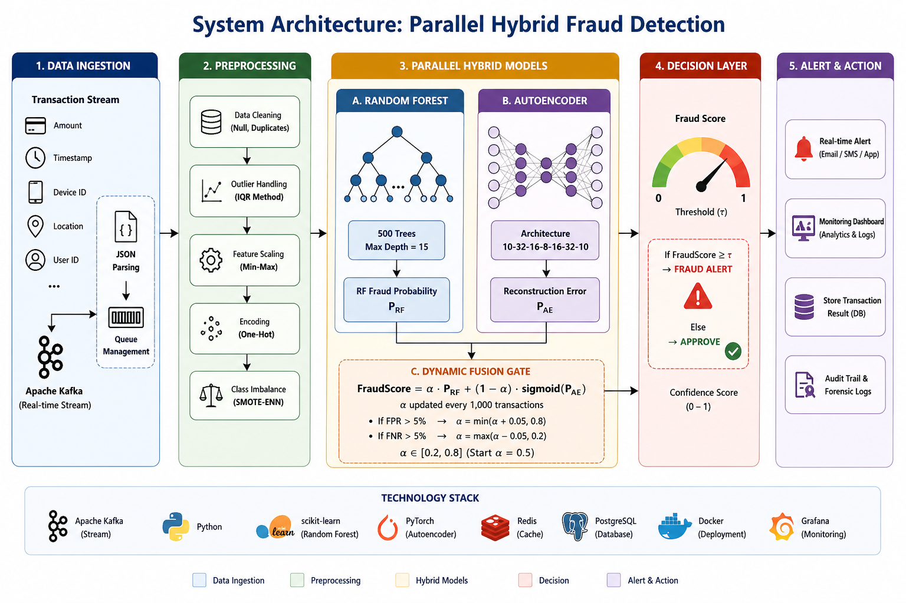

# 🛡️ Hybrid Machine Learning for Fraud Detection

<p align="center">
  
</p>

<p align="center">
  <a href="#abstract">Abstract</a> •
  <a href="#system-overview">Overview</a> •
  <a href="#methodology">Methodology</a> •
  <a href="#installation">Installation</a> •
  <a href="#author">Contact</a>
</p>

<p align="center">
  
  
  
  
</p>

---

## 📖 Abstract

This project presents a hybrid machine learning approach for detecting fraudulent transactions in digital banking systems. Traditional systems rely on static rules and struggle with delayed updates and severe class imbalance.

A stacking ensemble model combining Random Forest, Gradient Boosting, and Logistic Regression is implemented. To address imbalance, SMOTE-ENN resampling is applied, and temporal features are incorporated to improve predictive performance.

The system is designed for deployment in real-time fraud detection scenarios while maintaining efficient computational performance.

---

## ⚙️ System Overview

<p align="center">
  
</p>

<details>
<summary><b>View Processing Flow</b></summary>

1. Data preprocessing (cleaning, encoding, normalization)
2. Feature engineering (time-based features)
3. SMOTE-ENN resampling
4. Stacking ensemble training and prediction
5. Fraud classification output

</details>

---

## 🛠️ Tools & Technologies

| Category        | Tools                          |
| :-------------- | :----------------------------- |
| Language        | Python                         |
| ML Libraries    | Scikit-learn, imbalanced-learn |
| Data Processing | Pandas, NumPy                  |
| Documentation   | LaTeX                          |
| Version Control | Git & GitHub                   |

---

## 🧪 Methodology

<details>
<summary><b>View Methodology Details</b></summary>

* Data cleaning and preprocessing
* Feature engineering (transaction time patterns)
* Normalization and scaling
* SMOTE-ENN resampling to handle imbalance
* Training stacking ensemble model
* Model evaluation using classification metrics

</details>

---

## 📊 Evaluation Metrics

* Precision
* Recall
* F1 Score

---

## 📁 Dataset

* IEEE-CIS Fraud Detection Dataset (~1M transactions)
* IBM AML Dataset (~1.2M transactions)

---

## 🚀 Installation

```bash
git clone https://github.com/kidanenamhret/Hybrid-Fraud-Detection-Banking.git
cd Hybrid-Fraud-Detection-Banking
pip install -r requirements.txt
```

---

## ▶️ Usage

```bash
python src/main.py
```

---

## 📂 Project Structure

```
├── data/
├── models/
├── notebooks/
├── src/
├── system_arch.png
├── README.md
└── requirements.txt
```

---

## 📈 Expected Outcomes

<details>
<summary><b>View Targets</b></summary>

* Improved fraud detection performance
* Reduced impact of class imbalance
* Efficient model suitable for real-time scenarios

</details>

---

## 👤 Author

Mesfin Alemayehu
Computer Science – Hawassa University

---

<p align="center">
  
</p>
